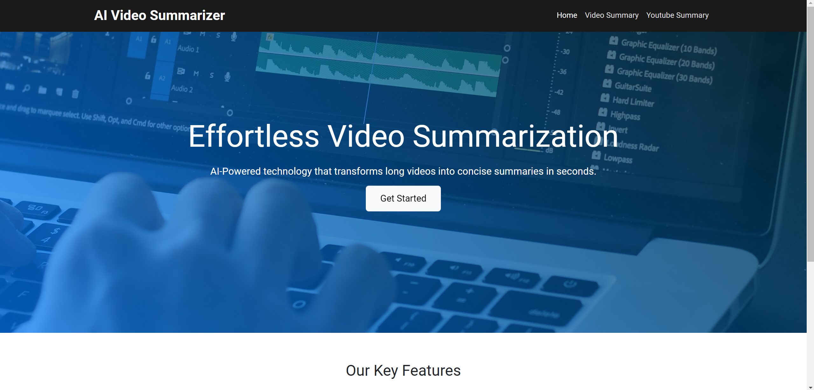
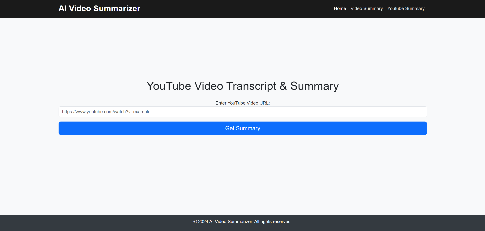
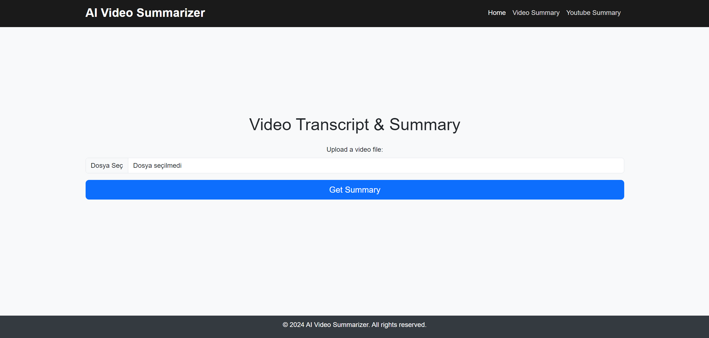

# 📝 Django Web-Based Video & YouTube Summary Tool

## 🎯 Project Overview
This project is a Django web application that provides a comprehensive solution for extracting and summarizing text from both YouTube videos and locally uploaded videos. The application utilizes deep learning models to deliver concise, high-quality summaries using advanced natural language processing (NLP) techniques.

## 🚀 Project Goals
The main objective of this project is to make video content more accessible and easy to consume by providing users with summaries of lengthy videos. Whether users need quick insights from a YouTube video or want to condense the information from their own media, this tool simplifies the process through automation and deep learning-powered NLP.

## 💡 Features
- **Home Page**: 
   - A sleek and modern interface featuring interactive animations powered by **JavaScript**.
   - Users can learn about the project and its benefits in a visually appealing way.

- **YouTube Summary**:
   - Users can input a **YouTube video link**, and the tool automatically extracts the video's transcript.
   - The extracted text is then summarized using the **HuggingFace `mrm8488/bert2bert_shared-turkish-summarization` model**.

- **Video Summary**:
   - Users can upload a video from their local device.
   - The transcript is generated from the video, followed by summarization using the **same AI model**.

## 🔧 Libraries Used
- **Django**: Web framework for building the application.
- **Torch**: Used for deep learning tasks.
- **MoviePy**: Extracts audio and text from videos.
- **Transformers**: Leverages HuggingFace's transformer models for summarization.
- **youtube_transcript_api**: Extracts transcripts from YouTube videos.

## 💼 Benefits to Users
- **Saves Time**: Instantly extract summaries from lengthy videos, allowing users to focus on key insights.
- **AI-Powered**: Uses a state-of-the-art **Turkish text summarization** model, ensuring high-quality and concise summaries.
- **User-Friendly**: With an intuitive interface and simple functionality, anyone can use this tool with ease.

## 🖥️ Screenshots
Here are some examples of the user interface:

### Home Page


### YouTube Summary Page


### Video Summary Page


## 🔍 How It Works
1. **YouTube Summary**:
   - Navigate to the **YouTube Summary** page.
   - Enter a valid YouTube video link.
   - Click **Submit**, and the transcript will be extracted and summarized.

2. **Video Summary**:
   - Navigate to the **Video Summary** page.
   - Upload your video file.
   - Click **Submit**, and the transcript will be extracted and summarized.


## 🔗 Useful Links
- [HuggingFace `mrm8488/bert2bert_shared-turkish-summarization`](https://huggingface.co/mrm8488/bert2bert_shared-turkish-summarization)

  
## 🙌 Contribution
Feel free to contribute to this project by submitting a pull request or reporting any issues you find. Contributions are always welcome!

## 🛠️ Installation & Setup
To run this project locally, follow these steps:

1. Clone the repository:
    ```bash
    git clone https://github.com/HasanCan6241/AIVideoSummarizer.git
    ```
2. Navigate to the project directory:
    ```bash
    cd AIVideoSummarizer
    ```
3. Install the required dependencies:
    ```bash
    pip install -r requirements.txt
    ```
4. Run the Django server:
    ```bash
    python manage.py runserver
    ```
